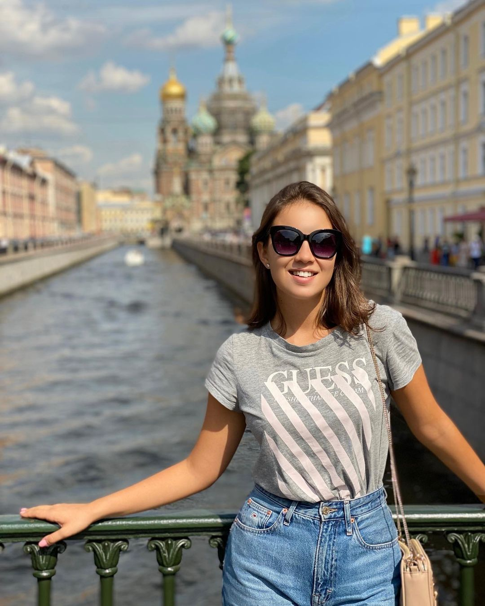

```{=html}
<style type="text/css">
.title {
  display: none;
}

#getting-started img {
  margin-right: 10px;
}

</style>
```
<div class="row" style="padding-top: 30px;">

::: col-sm-6
# Valeriya Basyrova
I am from  Ekaterinburg, Russia and am living in Milan Italy. I am persuing a masters in Linguistics.I love all languages. My specilaization is in English russian and Italian.

1.  See the [Russian page](https://ongevic.github.io/lera/Russian.html) for Rusian resources.

1.  See the [English page](https://ongevic.github.io/lera/English.html) for English resources.

1.  See the [Italian page](https://ongevic.github.io/lera/Italian.html) for Italian resources.

**Cape Diem**
:::

::: col-sm-6
### [Instagram: Follow me here](https://www.instagram.com/valeriya_basyrova/)

<a href = "https://www.linkedin.com/in/victor-ongera-156394114/">  </a>
:::
